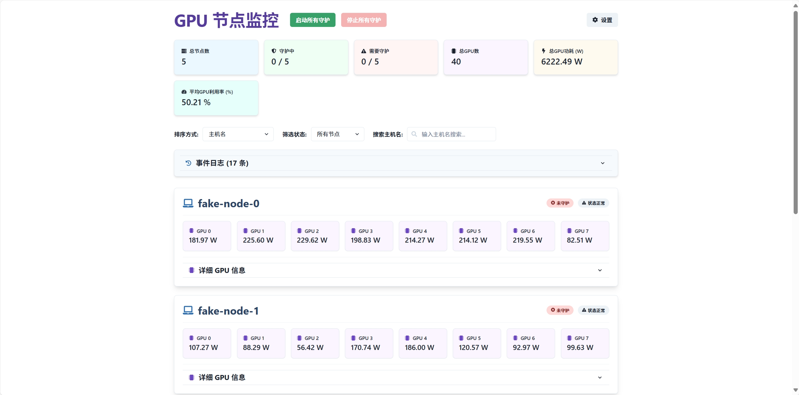
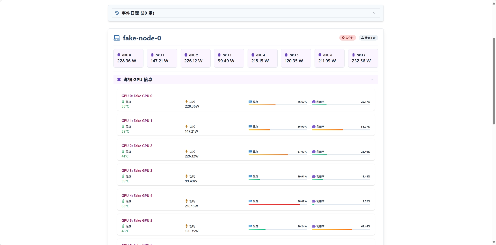
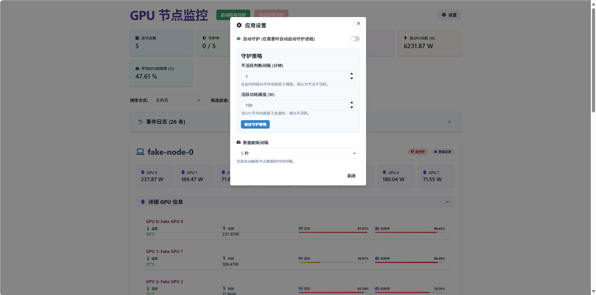

# GPU 节点监控与智能守护系统


这是一个基于 Flask 后端和 React 前端构建的 GPU 节点监控与智能守护系统。它旨在帮助用户实时监控多台服务器上的 GPU 状态（包括温度、利用率、显存和功耗），并提供自动或手动启动/停止 GPU 守护进程的功能，以优化资源利用和管理。

## 🚀 主要特性

* **实时节点监控：**

    * 展示所有 GPU 节点的详细信息，包括主机名、GPU 数量。
    * 每块 GPU 的实时数据：温度、利用率、已用/总显存、功耗。
* **概览统计：** 仪表盘顶部提供总节点数、守护中节点数、需要守护节点数、总 GPU 数、总 GPU 功耗和平均 GPU 利用率等关键指标。
* **智能守护策略：**

    * **自动守护：** 可配置当 GPU 在设定的时间内平均功耗低于阈值时，自动启动守护进程（例如，关闭不活跃的 GPU 任务）。
    * **手动控制：** 一键启动或停止所有节点的守护进程。
    * **可配置策略：** 用户可以通过设置界面调整“不活跃判断间隔”和“活跃功耗阈值”。
* **事件日志：** 实时记录系统的重要操作和状态变化，方便追踪和排查问题。
* **数据筛选与排序：**

    * 按主机名、GPU 数量、守护状态等对节点进行排序。
    * 按守护状态（所有、守护中、未守护、需要守护）进行筛选。
    * 支持按主机名进行模糊搜索。
* **友好的用户界面：** 使用 Chakra UI 构建，提供响应式和美观的用户体验。
* **确认弹窗：** 启动/停止所有守护进程时，提供确认弹窗，防止误操作。

## 🛠️ 技术栈

**后端 (Python Flask):**

* **Flask:** 轻量级 Python Web 框架，用于构建 API。
* **Flask-CORS:** 处理跨域请求。
* **Loguru:** 强大的日志库，方便记录系统事件。
* **假数据模拟:** `fake_nodes.py` 用于模拟 GPU 节点数据和守护行为，方便开发和测试，实际部署时可替换为真实的数据采集逻辑。

**前端 (React):**

* **React:** 用于构建用户界面的 JavaScript 库。
* **Chakra UI:** React 组件库，提供美观且可访问的 UI 组件。
* **Axios:** 基于 Promise 的 HTTP 客户端，用于与后端 API 交互。
* **React Hooks:** 充分利用 `useState`, `useEffect`, `useCallback`, `useMemo`, `useRef`, `useDisclosure` 等钩子管理组件状态和生命周期。

## 🖥️ 运行截图

### 仪表盘概览




### 节点信息



### 设置界面



## 🚀 快速启动

请确保您的系统已安装以下环境：

* **Python 3.8+**
* **Node.js 14+ 及 npm (或 yarn)**

### 1. 克隆仓库

首先，将项目仓库克隆到您的本地机器：

```bash
git clone https://github.com/WenmuZhou/gpu-monitor.git
cd gpu-monitor
```

### 2. 后端设置与运行
安装依赖
进入 backend 目录，并安装所需的 Python 依赖：

```bash
cd backend

# 安装依赖
pip install -r requirements.txt
```

运行后端服务
安装完成后，即可运行 Flask 后端服务：

```bash
python app.py
```

后端服务默认将在 http://localhost:5000 运行。如果一切正常，您会看到类似“* Running on http://127.0.0.1:5000 (Press CTRL+C to quit)”的输出。

### 3. 前端设置与运行
安装依赖
在新终端窗口中，返回项目根目录（如果之前进入了 backend），然后进入 frontend 目录，并安装所需的 Node.js 依赖：

```bash
cd frontend

# 安装依赖
npm install
```

运行前端应用
安装完成后，即可运行 React 前端应用：

```bash
npm start
```

前端应用默认将在 http://localhost:3000 运行。它通常会自动在您的默认浏览器中打开一个新的标签页。

## ⚙️ 配置 (可选)
后端 API 地址: 前端 frontend/src/services/api.js 中定义了 API_BASE_URL。如果您的后端不是在 http://localhost:5000 运行，请修改此文件。
守护策略: 通过前端界面的“设置”按钮进行配置。
模拟数据: backend/fake_nodes.py 文件用于模拟数据。在实际部署中，您需要将其替换为与实际 GPU 监控系统（如 Prometheus, NVIDIA-SMI, IPMI 等）集成的逻辑，或者连接到真实的服务器数据源。

## 🤝 贡献
欢迎通过 Pull Request 贡献代码、报告 Bug 或提出新功能建议！
